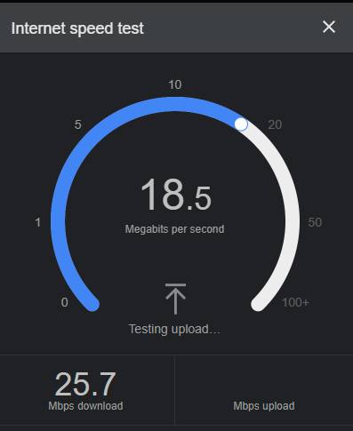
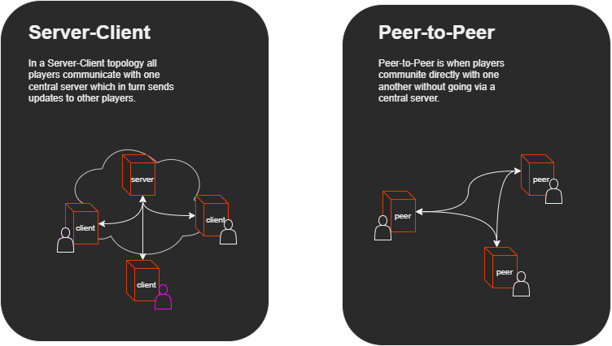

# Networking 101

Before writing our net code we're going to have to decide on the networking protocol and topology to use. To make an informed decision we will cover the basics of networking, different protocols and topologies. Then we will look at the practicle considerations implementing networking in MonoGame.

## Crash Course

Net code in game development is all about dealing with constraints, constraints on the volume, speed and frequency with which we can send and recieve information to other players. Specific terminology is used in networking which this snippet from  covers:

>It takes a variable amount of time to each peer (*latency*) and to a lesser degree a variable amount time each time (*jitter*).
>
>If you are sending/receiving more than the weakest link can deal with (in addition to everything else going through that link) data will be delayed. So we have another limit: our available *bandwidth*.
>
>Data is transmitted in discrete units: packets, which can go through different routes and arrive *out-of-order* to that they were sent in, not arrive at all: *packet loss*, or arrive more than once: *duplication*! Packet loss can occur for an infinite number of reasons in addition to exceeding bandwidth excessively, e.g. dog ate my network cable; and can just as quickly start working normally again, e.g. ... my brother closed his BitTorrent client.

Thankfully many of these issues are handled at the protocol level (e.g. using TCP based protocols deals with duplicate, out-of-order and lost packets giving the application a stream of ordered bytes as they were sent). Unfortunatly there is always a trade off e.g. if you want a reliable and in-order stream that means waiting for the next packet in sequence possibly requiring re-send adding latency and holding up reading data that may have already arrived!

### Latency

Latency will always exist no matter how fast your Internet connection - information cannot physically be transmitted faster than the speed of light! To get a rough idea typical latency between players in different regions of the world:

#### Sampling of Global Network Latencies

| From | To | Typical Latency (ms) |
| :--- | :--- | :--- |
| 🇺🇸 US East Coast | 🇺🇸 US West Coast | 50 - 90 ms |
| 🇺🇸 US East Coast | 🇬🇧 United Kingdom | 70 - 100 ms |
| 🇺🇸 US East Coast | 🇩🇪 Germany | 80 - 110 ms |
| 🇺🇸 US West Coast | 🇷🇺 Russia | 160 - 220 ms |
| 🇲🇽 Mexico | 🇨🇦 Canada | 50 - 80 ms |
| 🇦🇺 Perth, Australia | 🇬🇧 United Kingdom | 240 - 400 ms |
| 🇳🇿 Auckland, New Zealand | 🇯🇵 Japan | 130 - 160 ms |
| 🇳🇿 Auckland, New Zealand | 🇺🇸 US West Coast | 110 - 140 ms |
| 🇦🇺 East Coast Australia | 🇦🇺 West Coast Australia | 40 - 60 ms |
| 🇦🇷 Argentina | 🇯🇵 Japan | 260 - 320 ms |
| 🇵🇱 Poland | 🇿🇦 South Africa | 180 - 250 ms |
| 🇿🇼 Mutare, Zimbabwe | 🇦🇺 Darwin, Australia | 280 - 450 ms |

### Bandwidth

## Protocol

What protocols are avaliable and which should you use? That depends on the frequency and size of updates to other players. All the methods are built on the Internet Protocol (IP) which takes care of assigning IP addresses and routing packets.

| Use Case | Protocol |
| :---      | :---              |

## Topology

### Networking in MonoGame

In MonoGame we are using .NET which includes libraries for using the above networking methods in the `System.Net` namespace. There are also 3rd party .NET libraries some of which are built specifically games.

> [!NOTE]
> MonoGame does not implement the equivalent of `Microsoft.Xna.Framework.GamerServices` that existed in the XNA framework for networking becuase `GamerServices` was only for Xbox LIVE. 

> [!NOTE]
> When using a platform like Steam or consoles like PlayStation, Nintendo or Xbox there are official libraries or APIs to integrate with their identity management, further, there are libraries to assist with your multiplayer network code. For consoles you first have to have access, refer to: [Console Access | MonoGame](https://docs.monogame.net/articles/console_access.html), on Steam you need to be a Steamworks developer. Regardless of platform however your would still need to implement networking of updates between players which should be portable between platforms – you can still open sockets for HTTP, TCP and UDP communications on all platforms – its normally the identity management part that will be specific to each platform.

